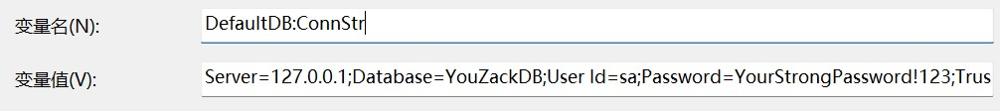

# 组件通信关系
如下图所示，为了运行样例项目，需要启动FrontEnd相关前端程序，YouZack-VNext相关后端程序，以及SQL Server等中间件服务。


2个前端程序，可以通过在CMD命令行中，运行yarn dev启动。6个WebAPI后端程序，可以通过VS Code启动。5个中间件，可以通过docker方式启动，简化安装和配置的过程。

# 通过docker运行中间件
安装docker desktop软件之后，可以通过docker-compose.yml配置文件，一次性启动5个中间件。
```bash
# 在CMD命令行中，cd导航到docker-compose.yml同一级目录
docker compose up -d # 启动容器集合
docker compose down # 关闭容器集合
```
容器全部启动完成之后，可以在docker desktop的控制台，看到相关容器的内存等资源占用情况，如下图所示，


其中Elastic Search占用内存最多，约为1.5GB，其次为SQL Server约为1GB，为了顺利运行所有中间件，建议，运行docker的宿主机空闲内存需要大于3GB。

## nginx.conf配置文件映射
在docker-compose.yml配置文件中，已经标注了宿主机相对docker-compose.yml所在目录的./nginx/nginx.conf，会被挂载到nginx对应的docker容器内部/etc/nginx/nginx.conf。

也就是说，如果需要修改docker内部的nginx配置，只要修改宿主机的./nginx/nginx.conf，就可以了。
```yml
  - ./nginx/nginx.conf:/etc/nginx/nginx.conf:ro # 挂载 Nginx 配置文件
```
由于nginx是运行在docker容器中，server指向的ip地址，需要使用运行后端程序的VS Code所在主机的IP地址，例如，192.168.88.6  这样，nginx才能将收到的请求，路由转发到VS Code启动的后端程序中。
```yml
  server 192.168.88.6:50401; 
```
nginx.conf配置完成之后，就可以查看nginx日志，或者让nginx重新加载conf配置。
```bash
# 在CMD命令行中，可以运行以下指令，完成nginx相关操作
docker exec -it netcore_nginx nginx -s reload # 重新加载nginx.conf配置文件 
docker logs -f netcore_nginx # 跟踪查看nginx日志 
```
## T_Configs数据配置
所有中间件都成功启动之后，就可以对数据库中的T_Configs表，进行配置，写入中间件对应的IP地址，如下图所示。如果中间件都运行在本机，就使用127.0.0.1，如果在其他机器，就使用对应主机的ip，例如，192.168.88.7


# 推荐的调测过程
## 1. 设置环境变量，初始化表结构
后端程序需要访问SQL Server数据库的T_Configs表，以便，获取中间件配置信息。
需要设置Windows操作系统的环境变量，指向SQL Server所在IP地址，名为 `DefaultDB:ConnStr` 值为 `Server=127.0.0.1;Database=YouZackDB;User Id=sa;Password=YourStrongPassword!123;TrustServerCertificate=True` 如下图所示。
并重启VS Code，以便，其能加载新的 `DefaultDB:ConnStr`



通过CMD命令行，使用ef组件，完成数据库迁移
```bash
# cd路由到YouZack-VNext目录，使用.NET的ef组件，完成数据库迁移和初始化
dotnet ef database update --project ./IdentityService.Infrastructure --startup-project ./IdentityService.WebAPI
dotnet ef database update --project ./MediaEncoder.Infrastructure  --startup-project ./MediaEncoder.WebAPI 
dotnet ef database update --project ./FileService.Infrastructure  --startup-project ./FileService.WebAPI 
dotnet ef database update --project ./Listening.Infrastructure  --startup-project ./Listening.Admin.WebAPI 
```
数据库迁移指令，全部执行成功之后，会生成14张数据库，如下图所示


## 2. 执行create world，新建admin用户
通过VS Code，启动后端程序 IdentityService.WebAPI 项目。

通过浏览器，访问URL `http://localhost:50402/swagger/index.html` 在页面上，Execute执行 /Login/CreateWorld。如果正常执行，就会在数据库T_Users表中，新建admin用户。

至此，后端程序已经可以正常和数据库通信。


## 3. 修改admin手机号
通过CMD命令行，cd路由到前端程序FrontEnd目录，使用yarn dev 启动 ListeningAdminUI 项目。

通过VS Code，启动后端程序 Listening.Admin.WebAPI 项目。

通过浏览器，访问URL `http://localhost:3000/` 以用户 admin 密码 123456 ，进行登录。再到 管理员管理，进行手机号修改。

如果，修改的手机号能够保存成功，至此，前端程序已经可以通过nginx正常和后端程序通信。


## 4. 上传mp3文件，转码成m4a
通过CMD命令行，cd路由到前端程序FrontEnd目录，使用yarn dev 启动 ListeningMainUI 项目。

通过VS Code，启动后端程序 Listening.Main.WebAPI、FileService.WebAPI、MediaEncoder.WebAPI、SearchService.WebAPI 项目。

通过浏览器，访问URL `http://localhost:3000/` 以用户 admin 密码 123456 ，进行登录。再到 听力管理，创建音频 并上传一个mp3格式的音频。

在Listening.Admin.WebAPI项目，Episodes/EpisodeController.cs文件，Add方法，会判断音频文件是否为m4a格式，如果不是m4a格式，就通过 eventBus.Publish "MediaEncoding.Created" 通过发送MQ消息，通知转码服务进行音频转码。

在MediaEncoder.WebAPI项目，EventHandlers/MediaEncodingCreatedHandlers.cs文件，会监听MQ消息 EventName("MediaEncoding.Created")，将转码任务持久化到T_ME_EncodingItems表。

在MediaEncoder.WebAPI项目，BgServices/EncodingBgService.cs文件，ExecuteAsync方法，会每隔5秒，从数据库查询ItemStatus.Ready的等待转码任务，再调用ProcessItemAsync(readyItem, ct)，进行转码。在ProcessItemAsync方法中，如果有多个转码服务器，会通过redis的分布式锁redLock，控制每个转码任务同一时间只有一台转码服务器在处理。最终的转码工作，在ToM4AEncoder.cs文件，EncodeAsync方法，通过ffmpeg.exe将音频转换为m4a格式。

如果浏览器中，显示mp3的音频，成功转码成m4a格式，至此，后端程序已经可以正常和MQ、Redis、ES进行通信。


# 成不在我，功不唐捐。GOOD LUCK！